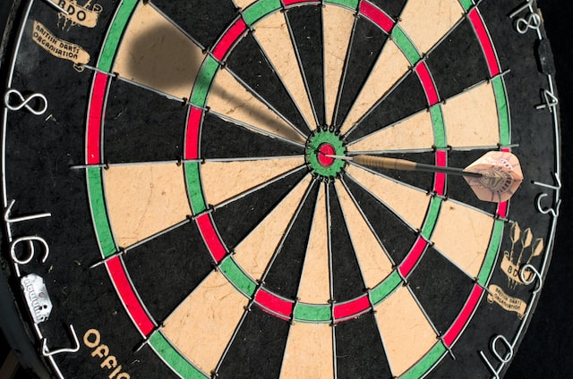
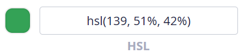
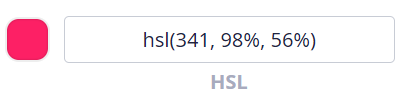
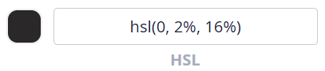
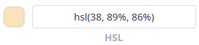
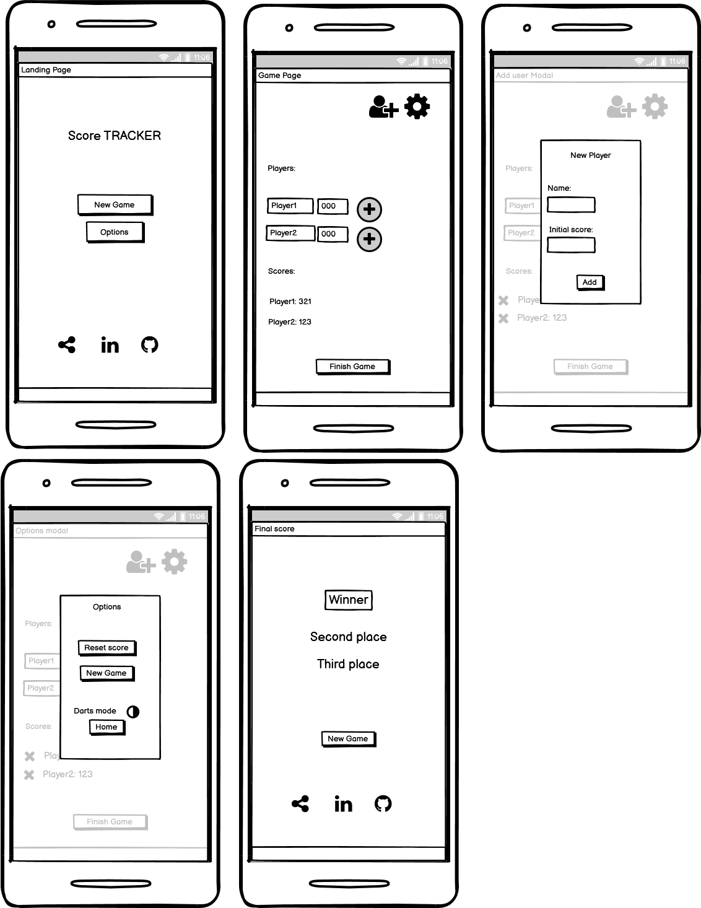
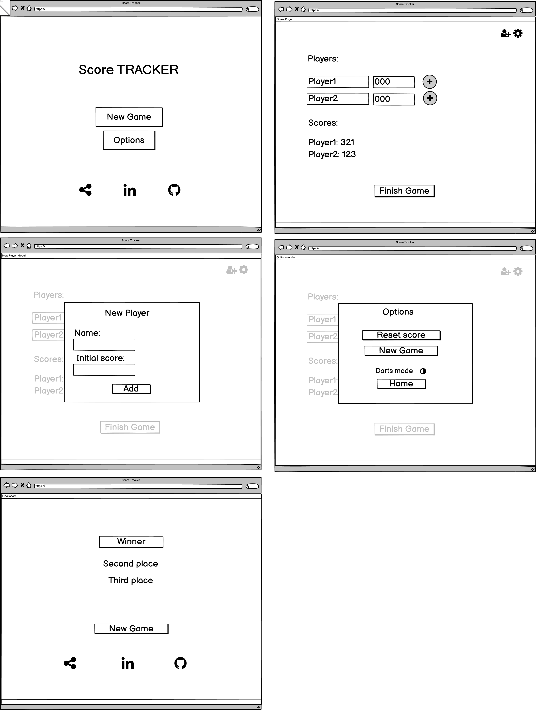

# Score TRACKER
A web application to track any game score

Have you ever played darts with your friends (or any other game), without having the tool to track your scores? Did you find yourself trying to keep track of the score in the retro of an old receipt or on the "Notes" application of your phone?

Score TRACKER is the solution.

A simple and intiuitive navigation, to use for your games.

[See deployed website]()

## Table of content

- [Design and User Experience](#design-and-user-experience)
  - [Design](#design)
  - [User Experience](#user-experience)
  - [Wireframes](#wireframes)

- [Features](#features)
  - [Landing Page](#landing-page)
  - [Game Page](#game-page)
  - [Add Player](#add-player)
  - [Options](#option)
  - [Final Score Page](#final-score)

- [Testing](#testing)
  - [Tests](#tests)
  - [Validator Testing](#validator-testing)
  - [Fixed bugs](#fixed-bugs)
  - [Unfixed bugs](#unfixed-bugs)
  - [Performance](#performance)

- [Deployment](#deployment)
  - [Live Website](#live-website)
  - [Local Deployment](#local-deployment)

- [Credits](#credits)
  - [Content](#content)
  - [Media](#media)

- [Technologies used](#technologies-used)

## Design and User Experience

### Design

The design is based on the "Darts" game, which inspired this webpage.

- Color scheme inspiration:

- Primary Color:

- Secondary Color:

- Dark Color:

- Neutral Color:

### User Stories

- As website owner I want:
    - To have an engaging design to cathc the users attention
    - That users are prompt to share the website with their friends

- As a user I want:
    - To easily understand the purpose of the website.
    - To have a clear navigation.
    - To have the option to ammend the score if I made a mistake.
    - To be able to restart the game without having to re-enter all the players name.

### Wireframes

  
Mobile

    

  
Desktop

    

## Features 

### Landing page

- __New game__

- __Options__

- __Social media links__

### Game Page

- __New player__

- __Options__

- __Ad score section__ 

- __Total score__

- __Finish game__

### Add player

### Options

### Final score page

## Testing 

To test my website I have opened it on different devices, to see if it was working as expected.

- Browser tested:

- Operating systems:

### Tests

  

  
Testing

  |Action | Expected behavious | Result|
  |-------|--------------------|-------|
  |action here | Bhaviour here | Pass/Fail |
  |action here | Bhaviour here | Pass/Fail |
  |action here | Bhaviour here | Pass/Fail |
  |action here | Bhaviour here | Pass/Fail |

  

### Validator Testing

- HTML
  - Errors returned when passing the final version through the official [W3C validator](https://validator.w3.org/nu/#textarea)
- CSS
  - Errors when passing the final version through the official [Jigsaw validator](https://jigsaw.w3.org/css-validator/validator)
- JavaScript
  - Errors found when passing the final version through the official [Jshint validator](https://jshint.com/)

### Fixed Bugs

### Unfixed Bugs

### Performance

I have tested the performance in chrome, using lighthouse:

  
 Mobile 

  
  - Home page:

   

  
 Desktop 

  
  - Home page:

   

## Deployment

### Live Website

- The site was deployed to GitHub pages. The steps to deploy are as follows: 
  - In the GitHub repository, navigate to the Settings tab 
  - From the source section drop-down menu, select the Master Branch
  - Once the master branch has been selected, the page will be automatically refreshed with a detailed ribbon display to indicate the successful deployment. 

The live link can be found here - [Live Website]()

### Local Deployment
  - For a local deployment follow these steps:
    - Create a new directory on your machine, where you want do deploy the files
    - Open the existing repository in GitHub
    - Go to the "Code" tab
    - Click on the "Code" button
    - Copy the HTTPS link
    - Open your terminal and run the command __git clone 'link'__
    - use the link just copied, without quotes, instead of 'link'

## Credits 

### Code

The code for adding an event listener using data-type was taken from the [Code Institute course](https://codeinstitute.net/global/)

Lesson: Love Maths Walkthrough Project - Adding some JavaScript - Creating Event Listeners.

### Content

- Instructions on how to ##### were taken from [Site name](link)

- The icons were taken from [Font Awesome](https://fontawesome.com/)

- The following fonts, used for the project, are from [Google Fonts](https://fonts.google.com/):
  - 
  - 

### Media

- The photos used for this website are from [Unsplash](https://unsplash.com/)
  - Darts photo by [Immo Wegmann](https://unsplash.com/@macroman?utm_source=unsplash&utm_medium=referral&utm_content=creditCopyText)
  
  

## Technologies used

  - HTML
  - CSS
  - JavaScript
