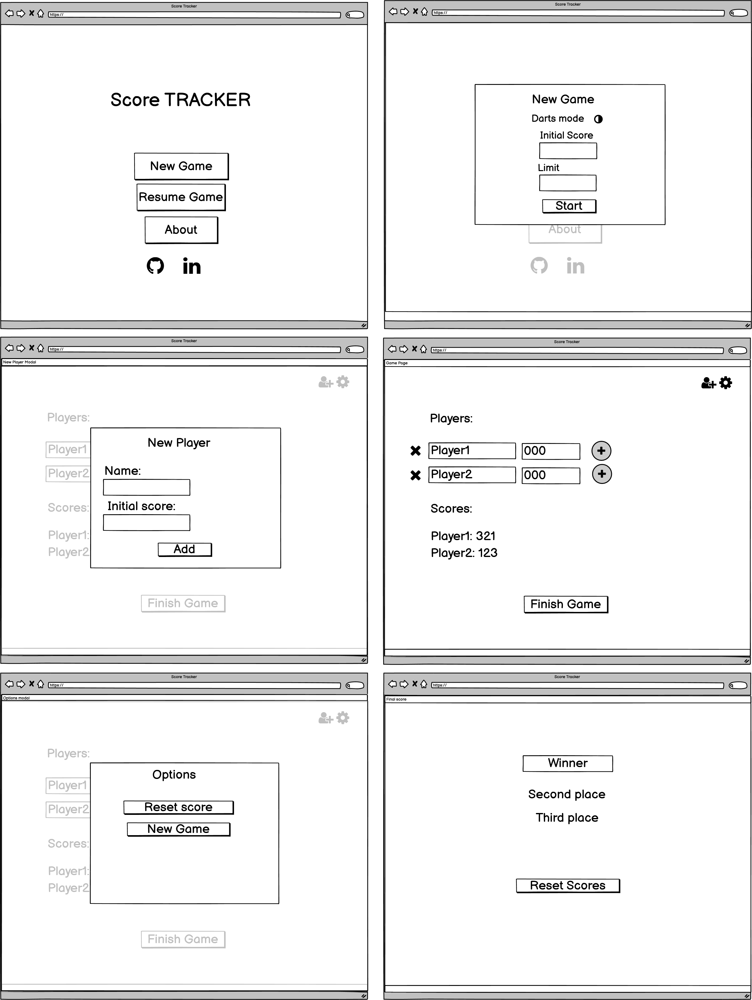

# Score TRACKER
A web application inspired by darts, but that can be used to track any game score.

Have you ever played darts with your friends (or any other game), without having the tool to track your scores? Did you find yourself trying to keep track of the score in the retro of an old receipt or on the "Notes" application of your phone?

Score TRACKER is the solution.

A simple and intiuitive design, easy to use for your games.

[See deployed website](https://elisacch.github.io/score-tracker/index.html)

## Table of content

- [Design and User Experience](#design-and-user-experience)
  - [Design](#design)
  - [User Stories](#user-stories)
  - [Wireframes](#wireframes)

- [Features](#features)
  - [Landing Page](#landing-page)
  - [Game Page](#game-page)
  - [Leaderboard](#leaderboard)

- [Testing](#testing)
  - [Tests](#tests)
  - [Validator Testing](#validator-testing)
  - [Fixed bugs](#fixed-bugs)
  - [Unfixed bugs](#unfixed-bugs)
  - [Performance](#performance)

- [Deployment](#deployment)
  - [Live Website](#live-website)
  - [Local Deployment](#local-deployment)

- [Credits](#credits)
  - [Code](#code)
  - [Content](#content)

- [Technologies used](#technologies-used)

## Design and User Experience

### Design

The design is based on the "Darts" game, which inspired this webpage.

- Color scheme inspiration:

- Primary Color:

- Secondary Color:

- Dark Color:

- Neutral Color:

### User Stories

- As website owner I want:
    - To have an engaging design to catch the users attention.
    - That the website is accessible for all users.

- As a user I want:
    - To easily understand the purpose of the website.
    - To have a clear navigation.
    - That the design is responsive for mobile, so that I can have it always with me when I go out playing.
    - To easily add or remove points with one click.
    - To have a leaderboard where I can see the winner and ranking.
    - To be able to restart the game without having to re-enter all the players name.

### Wireframes

  
Mobile

    

  
Desktop

    

## Features 

### Landing page

The landing page is designed to fit in all mobile screens.

- __New game__

There are two game modes, and the player can easily switch between the two when starting the game, and decide which mode suits better.

    - Darts Mode enabled: 
      - The goal is to reach 0 poins, and the user should select an initial score higher than zero. 
      - This is usually set to 501 or 301, so when enableing darts mode, the initial value will be set to 501, but the player can change it easily.
      - The limit will be set automatically to zero. If one player reaches or exceeded 0 then the game will prompt to finish the game and open the leaderboard.

    - Darts Mode disabled:
      - The goal is to reach the higher score.
      - The initial value will be set to 0, but the players can decide to change it for another value.
      - There is an option to set a limit score. If set the leamit will prompt the players to finish the game when reached. If not set the players will be able to finish the game manually.

 

The players can click on "Start" to begin the game or they can exit the modal.

- __Resume__

The resume button is disabled if there is no open game, and it will be enabled if the player starts a game, so that the user can go back to the game at any time.

- __About__

This button opens up a modal with an explaination of the functionalities and the two modes available. 

  
See preview

    

- __Social media links__

Social media links to find the site owner ( me! :) ) on gitHub and linkedIn on see my other projects:    
 

### Game Page

When we create a new game we are redirected to the game page, where the user can add players and manage the game.

When the game starts there are no players, so the page will inform the user to add one player to start.

When at least on eplayer is added, the placeholder image and text disappear and we see the input to add or remove points, and the updated score for each player.

  

- __Header__

The header contains 3 action buttons:

    - Logo, that will redirect to the homepage.
    - Add Player button.
    - Options button.

- __Add player__

The user can add the playes by clicking on this icon.

A modal will open to enter the name of the player, and the initial score set for the game will be displayed. 

The user can decide to change the initial score, for example if a player need to be added in the middle of the game, or to re-enter a player deleted by accident.

  
See preview

    

- __Options__

This button will open a modal that contains the two following commands:

    - New game, which will open the "New Game" modal as in the landing page. It allows the users to create a new game, deleting the players, setting a new initial score and selecting the game type (Darts or not).

    - Reset score, which will keep all the players and the current mode, but will set all the scores to the initial value set for the game.

  
See preview

    

- __Target section__ 

This section is meant as reminder of the target score. 

It is initially set to 0, if the game is in Darts mode, or to the limit value set by the user for the current game.

If no limit is set, this section will indicate if the target is the higher score or the lower score, based on the game type. For example if the darts mode is disabled, the target will be to reached the higher score possible.

 

- __Players section__ 

This section is the core of the website. It allows to add and removes points to each player.

The user needs just to enter the points in the input associated to the desired players, and click to plus or minus sign to add or remove these points from the total.

 

This section was initially designed to have only one button which was performing a different oparation based on the game type.

    - For Darts Mode, it contained a minus sign (-), and the points were subtracted from the total.
    - For Non-darts Mode, it contained a plus sign (+), and it was adding the points to the total.

This approach was confusing for the users, who have found it difficult to understand. For this reason the second button was introduced, so that the user can easily add or remove points in one click.

  
See the two verisons compared

      

- __Remove players__ 

Next to each player there is a button that can be used to remove the player from the game.
  

It will open a new filed that asks confirmation before deleting one player.
This was added to prevent the users from deleting one player unintentionally.

 

- __Scores section__

This section shows the updated score for each player

- __Finish game modal__

If one player reaches or exceeds the target (if set), then the system will open a pop-up to inform the players and ask them if they want to finish the game.

If the users select finish, they will be redirected to see the leaderboard.

If they select no the pop-up will close and they can continue the game.
In this case the limit will be removed, to avoid the pop-up to open each time they add or remove points.

  
See preview

     

- __Finish game button__

This button can be used to show the leaderboard at any time during the game.

It will be disabled if there are no players added and enabled if there is as low as 1 player.

  

### Leaderboard

This page shows the leaderboard, and the winner highlighted on the top.

Depending on the game type (Darts mode or not), the ranking might be from the lower score to the higher, or viceversa.

This page contains also the button to reset the scores directly, if the players want to start a new round, or they can simply exit and continue from where they left off.

  

## Testing 

To test my website I have opened it on different devices, to see if it was working as expected.

### Tests

  

  
Home page - General

  |Action | Expected behavious | Result|
  |-------|--------------------|-------|
  |Copy and paste the url in the browser to open it | index.html should open and show the homepage | Pass |
  |Change the url to go to the game.html page | Because there is no game initiated I should be redirected to index.html | Pass |
  |Click on the logo | Where are already in homepage so the page should refresh | Pass |
  |Click on New Game button | The New Game modal should open | Pass |
  |Click on the X button | The New Game modal should close | Pass |
  |Check the Resume Game button | Because there is no game initiated the button should be disabled | Pass |
  |Click on the About button | The About modal should open | Pass |
  |Click on the X button | The About modal should close | Pass |
  |Click on the GitHub icon | A new tab should open and show gitHub profile | Pass |
  |Click on the LinkedIn icon | A new tab should open and show LinkedIn profile | Pass |

  

  

  
New Game modal - General

  |Action | Expected behavious | Result|
  |-------|--------------------|-------|
  |Uncheck the Darts Mode checkbox | The Limit field should show up and initial score suggested should be 0 | Pass |
  |Check the Darts Mode checkbox | The Limit field should be hidden and initial score suggested should be 501 | Pass |
  

  

  
New Game modal - When Darts Mode is enabled

  |Action | Expected behavious | Result|
  |-------|--------------------|-------|
  |Remove the value from Initial Score Field and click on Start | An error message should inform me to enter the initial score | Pass |
  |Enter a negative value and click on Start| An error message should inform me that the Initial Score must be greater than 0 | Pass |
  |Enter 0 and click on Start| An error message should inform me that the Initial Score must be greater than 0 | Pass |
  |Enter a value less than -10000 and click on Start| An error message should inform me that the Initial Score must be greater than or equal to -10000 | Pass |
  |Enter a value greater than 10000 and click on Start| An error message should inform me that the Initial Score must be less than or equal to 10000 | Pass |
  |Enter something different from a number| An error message should inform me that the Initial Score must be a number| Pass |
  |Enter a value between 1 and 9999 | Form should be submitted and I should be redirected to game.html | Pass |
  

  

  
New Game modal - When Darts Mode is disabled

  |Action | Expected behavious | Result|
  |-------|--------------------|-------|
  |Remove the value from Initial Score Field and click on Start | An error message should inform me to enter the initial score | Pass |
  |Enter a value less than -10000 and click on Start| An error message should inform me that the Initial Score must be greater than or equal to -10000 | Pass |
  |Enter a value greater than 10000 and click on Start| An error message should inform me that the Initial Score must be less than or equal to 10000 | Pass |
  |Enter a value less then -10000 or greater than 10000 in the Limit field| An error message should inform me that the value should be greater than or equal to -10000 or less then or equal to 10000| Pass |
  |Enter a value between -9999 and 10000 as Initial Score, and an lower or equal value as Limit | An error message should inform me that the Initial Score must be less than Limit | Pass |
  |Enter a value between -10000 and 9999 as Initial Score, and a number between Initial Score and 10000 as Limit | Form should be submitted and I should be redirected to game.html | Pass |
  

  

  
Home page - After one of the two game has been initiated

  |Action | Expected behavious | Result|
  |-------|--------------------|-------|
  |Check the Resume Game button| Button should now be enabled | Pass|
  |Click on the Resume Game button | I should be redirected to game.html | Pass |

  

  

  
Game page - General

  |Action | Expected behavious | Result|
  |-------|--------------------|-------|
  |The page loads after starting a new game | There should be no player showing on the screen, but a placeholder instead asking to add one player | Pass |
  |Click on the logo | It should bring me back to the homepage | Pass |
  |Click on the Add Player icon | The Add Player modal should open | Pass |
  |Click on the X icon | The Add Player modal should close | Pass |
  |Click on the Options icon | The Options modal should open | Pass |
  |Click on the X icon | The Options modal should close | Pass |
  |Check the Target field | It should display the limit set for the game, if any. It can display a message stating that the target is the higher/lwer score if limit is not set | Pass |
  |Check the Finish Game button | Because there are no players yet the button should be disabled | Pass |
  |Click on the GitHub icon | A new tab should open and show gitHub profile | Pass |
  |Click on the LinkedIn icon | A new tab should open and show LinkedIn profile | Pass |

  

  

  
Add Player modal

  |Action | Expected behavious | Result|
  |-------|--------------------|-------|
  |Click on start to submit without entering the Name | A message should inform me that a name is required | Pass |
  |Enter a single character as Name and Submit| A message should inform me that the name must be at least 2 characters | Pass |
  |Enter a valid name and keep the suggested Initial Score | The form should be submitted and the player added to the game | Pass |
  |Enter a name of a player already existing | An error message should inform us that the playr already exists | Pass |

  

  
Add Player modal - Initial score

  |Action | Expected behavious | Result|
  |-------|--------------------|-------|
  | | If the Game was created in Darts Mode |  |
  |Enter a valid name and a score lower than or equal to 0 | An error should inform us that Initial Score should be greater than 0 | Pass |
  |Enter a valid name and a score higher than 10000 | An error should inform us that Initial Score should be less than or equal to 10000 | Pass |
  Enter a valid name and a score greater than 0 and lower than or equal to 10000| The form should be submitted and the player added to the game | Pass |
  | | If the Game was created in Non-darts Mode |  |
  |Enter a valid name and a score higher than or equal to the limit set for the game | An error should inform us that Initial Score should be less than the target score | Pass |
  |Enter a valid name and a score lower than -10000 | An error should inform us that Initial Score should be greater than or equal to -10000 | Pass |
  Enter a valid name and a score greater than or equal to -10000 and lower than the Target score| The form should be submitted and the player added to the game | Pass |

  

  

  
Options modal

  |Action | Expected behavious | Result|
  |-------|--------------------|-------|
  |Click on the New Game button | The New Game modal should open and work as in homepage | Pass|
  |click on Reset Score button| The score for all players should be set to the initial Score choosen for the game  | Pass |

  

  

  
Players and Scores area

  |Action | Expected behavious | Result|
  |-------|--------------------|-------|
  |Add one or multiple players | All players should have a dedicated line under Players and under Scores| Pass |
  |Check the Scores area| To each player should be assigned the initial score set when adding the player | Pass |
  | |Add and Remove points| |
  |Under Players area check the line dedicated to each player | For each player there is a dedicated points input and two buttons (+) and (-) | Pass |
  |In the points input add a value between -10000 and +10000 and click on the (+) button | The points are added to the player's score and the updated total is visible in the Scores section | Pass |
  |In the points input add a value between -10000 and +10000 and click on the (-) button | The points are subtracted from the player's score and the updated total is visible in the Scores section | Pass |
  |Enter a value lower than -10000 or greater than 10000 and click on (+) | An error message should inform us that the value is out of range | Pass |
  |Enter a value lower than -10000 or greater than 10000 and click on (-) | An error message should inform us that the value is out of range | Pass |
  |Try to enter something different from an integer: example -- or 4-7-3 and press (+) or (-)| An error message should inform us that the value is invalid | Pass |

  

  

  
Remove Player button

  |Action | Expected behavious | Result|
  |-------|--------------------|-------|
  |Click on the (x) button next to a player-s name | The Remove Player confirmation message should appear | Pass |
  |Click on Yes | The Player is removed from Playes section and from Scores section | Pass |
  |Click on No | The Confirmation message will close and no action is taken on the player | Pass |

  

  

  
Finish Game features

  |Action | Expected behavious | Result|
  |-------|--------------------|-------|
  |Check the Finish Game button | Now that there is at least one player the button is enabled | Pass |
  |Click on the Finish Game button | The leaderboard should appear | Pass |
  |Check the players order and the scores | If the game was in Darts Mode, the players should be ordered from the lower to the higher score | Pass |
  |Check the players order and the scores | If the game was not in Darts Mode, the players should be ordered from the higher to the lower score | Pass |
  |click on the X button | The Leaderboard should close | Pass |
  |click on Reset Score button | The score for all players should be set to the initial value choosen for the game | Pass |
  |If a limit was set, manually or automatically, add or remove points until one player reaches or exceeds the target | A modal should appear to ask if the players want to finish the game | Pass |
  |click on Yes | The Leaderboard should appear | Pass |
  |click on No | The message sgould disappear and the limit removed, so that players can keep playing | Pass |

  

### Validator Testing

#### HTML

 No Errors returned when passing the final version through the official [W3C validator](https://validator.w3.org/nu/#textarea)

  

  
W3 - HTML validation screenshot

  
  
  

#### CSS

 No errors when passing the final version through the official [Jigsaw validator](https://jigsaw.w3.org/css-validator/validator)

  

  
W3 - CSS validation screenshot

  
  
  

#### JavaScript

JsHint has been used during development to identify any possible issue and resolve them.

0 errors were found when passing the final version through the official [JsHint validator](https://jshint.com/), but only 4 warnings.

 

  
JsHint - JS validation screenshot

  

  

### Fixed Bugs
- Remove Players function:
  - First Bug: When I added the function to remove one player from the local storage, I added the function to display the payers again, so that it would read the updated local storage and the display area accordingly.
  Instead of removing the corresponding div from the display area it duplicated it, showing two divs for the same player.
  - Fix: Instead of calling the function __displayPlayers()__ I added a function to reload the page so that the program can read the updated local storage.

  

- Update Score function:
  - Bug: This function takes the value from input of type "number". This input allows also the value '__e__' and it caused the score to be updated to '__null__'. This also breaks the function, since we cannot add or remove any value from 'null'.
  
  - Fix: I implemented a validation that prevents the value 'e' to be entered. 

  

  - Second Bug: The input also allowed to enter multiple plus and minus signs, causing the following walue to be returned: "__NaN__".
  
  - Fix: For the second issue I have implemented a validation (.isNaN()) to check if the value converted to float returns NaN or a valid number.
   

### Unfixed Bugs

- There are no known unfixed bugs.

### Performance

I have tested the performance in Chrome, using Lighthouse:

  
 Mobile 

  
  - Homepage:

   

  - Game page:

   

  
 Desktop 

  
  - Homepage:

   

  - Game page:

   

## Deployment

### Live Website

- The site was deployed to GitHub pages. The steps to deploy are as follows: 
  - In the GitHub repository, navigate to the Settings tab 
  - From the source section drop-down menu, select the Master Branch
  - Once the master branch has been selected, the page will be automatically refreshed with a detailed ribbon display to indicate the successful deployment. 

The live link can be found here - [Live Website](https://elisacch.github.io/score-tracker/index.html)

### Local Deployment
  - For a local deployment follow these steps:
    - Create a new directory on your machine, where you want do deploy the files
    - Open the existing repository in GitHub
    - Go to the "Code" tab
    - Click on the "Code" button
    - Copy the HTTPS link
    - Open your terminal and run the command __git clone 'link'__
    - use the link just copied, without quotes, instead of 'link'

## Credits 

### Code

- The code for adding an event listener using data-type was taken from the [Code Institute course](https://codeinstitute.net/global/)
Lesson: Love Maths Walkthrough Project - Adding some JavaScript - Creating Event Listeners.

- To prevent the possibility to add __e__ and __+__ as values into the add pointa input, I checked this page in [stackoverflow](https://stackoverflow.com/questions/39291997/how-to-block-e-in-input-type-number) but changing the code to adapt it to my needs.

- The code to sort an array of objects based on one parameter was taken from this tutorial of All things JavaScript, LLC [JavaScript Problem: Sorting an Array of Objects](https://www.youtube.com/watch?v=0d76_2sksWY)

- The code to trap focus inside a modal was taken from this tutorial of Ben Nadel [Trapping Focus Within An Element Using Tab-Key Navigation In JavaScript](https://www.youtube.com/watch?v=VfKbvzGqEDU)

### Content

- The icons were taken from [Font Awesome](https://fontawesome.com/)

- The following fonts, used for the project, are from [Google Fonts](https://fonts.google.com/):
  - Quicksand.

## Technologies used

  - HTML
  - CSS
  - JavaScript

## Ackowledgements

A special thank to my mentor __Dick Vlaanderen__ for his precious feedback on this project.